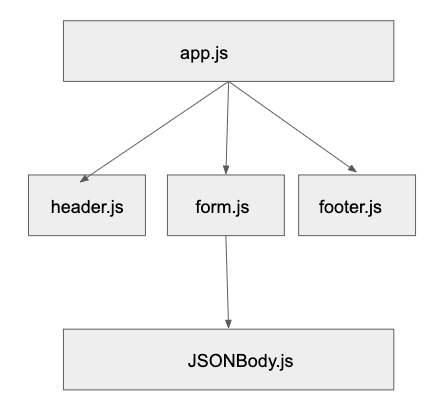

 LAB
=================================================

## RESTy with hooks

### Author: Melissa Stock

### Links and Resources
* [submission PR](https://github.com/401-advancedjs/RESTy/pull/1)
* [travis](https://www.travis-ci.com/401-advancedjs/RESTy)
* [front-end](https://priceless-volhard-0ff52c.netlify.com/)

### Modules
#### `app.js`
#### `form.js`
#### `header.js`
#### `footer.js`
#### `JSONBody.js`

#### Running the app
* `npm run start`
  
#### Tests
* How do you run tests?
  * `npm run test`
* What assertions were made?
  * all components have basic rendering
  * all functionality behaves as expected
  * rendering follows snapshot
* What assertions need to be / should be made?
  * None at the moment

#### UML

